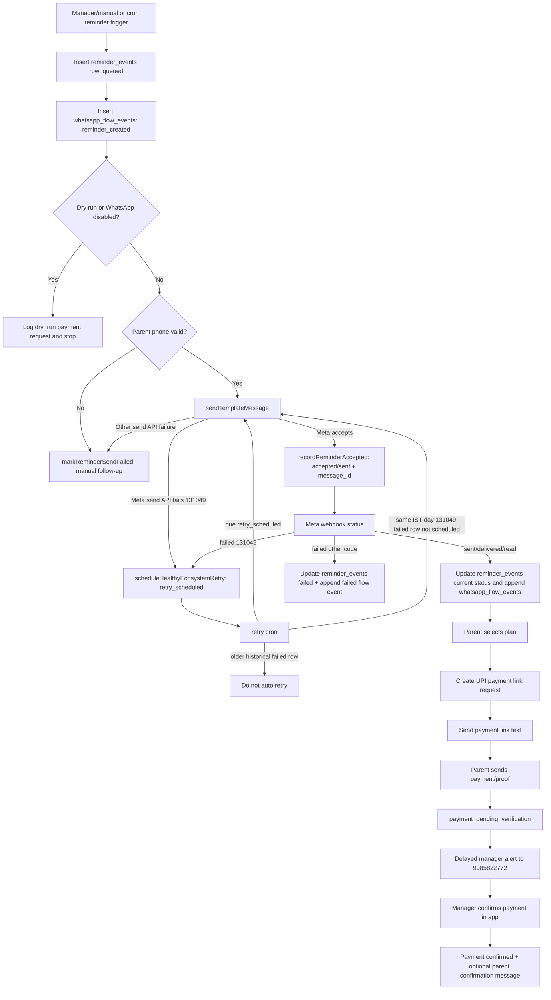

# WhatsApp Reminder Flow Map

This is the canonical map for Gen Alpha fee reminders. Use this before changing reminder, retry, payment-link, or timeline behavior.

## Sources Of Truth

- `reminder_events`: one current-state row per reminder run for a player.
- `whatsapp_flow_events`: append-only audit stream for reminder, Meta status, parent reply, payment link, proof, and manager alert steps.
- `whatsapp_webhook_events`: raw inbound webhook diagnostics.
- `student_timeline`: player history. WhatsApp rows should come from `whatsapp_flow_events`; legacy direct reminder rows are disabled by `supabase/whatsapp-reminder-flow-cleanup.sql`.

## Flow Tree

## Retry Rules

- Retry only `131049` / healthy ecosystem errors automatically.
- Do not auto-retry `131026 Message undeliverable`; it needs manual follow-up.
- Scheduled retry rows use `status = retry_scheduled` and `next_retry_at`.
- Fallback recovery can pick up unscheduled `131049` failed rows only from the current IST day.
- Historical failures must stay historical and should not be revived by the retry worker.
- Worker batch size is capped at 20 with a small delay between sends.

## Timeline Rules

- Main user-visible WhatsApp events:
  - `WhatsApp reminder prepared`
  - `Reminder failed`
  - `Reminder delivered`
  - `Reminder read`
  - `Parent selected renewal plan`
  - `Payment link sent`
  - `Parent payment proof received`
  - `Payment confirmed by academy`
- Operational noise to suppress in UI:
  - `accepted`
  - `sent`
  - retry scheduled rows
  - legacy `Renewal reminder prepared` / `Joining fee reminder prepared`
- Show time as IST `HH:mm:ss` wherever player timeline timestamps are displayed.

## June 2, 2026 Audit Result

Five reminder records were created in the 15:00 IST run:

- Lithvik tiru lohan G: delivered/read.
- Syed Musbah: accepted/sent only, no failed status in the tracked data.
- Gowshik Ch: delivered/read.
- Shaswat p: failed once with `131049`, retried, delivered/read, then parent selected a plan.
- Leela Krishna C: failed with `131026 Message undeliverable`; no auto-retry should run.

So the correct interpretations are:

- `5` reminder records in the June 2 run.
- `2` failed delivery attempts.
- `1` retry-eligible failed attempt.
- `1` currently failed reminder row.
